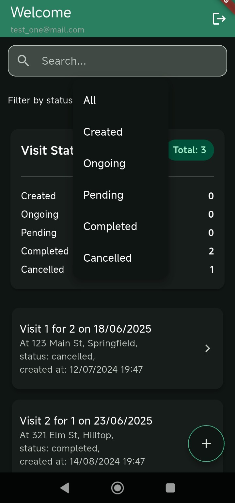

# Kib Sales Force

A Flutter-based Visits Tracker for RTM Sales Force Automation that helps sales teams manage and track customer visits efficiently.

## Overview

Kib Sales Force is a mobile application designed to streamline the process of tracking and managing customer visits for sales teams. The app provides features for creating, managing, and analyzing customer visits, with robust offline support and real-time synchronization.

### Key Features

- User Authentication (Firebase Auth)
- Customer Visit Management
- Offline Data Support
- Visit Statistics and Analytics
- Search and Filter Capabilities
- Dark/Light Theme Support

## Screenshots

### Visit Management


### Search and Analytics



## Architecture

The application follows a clean architecture pattern with the following key components:

### 1. Presentation Layer
- Screens and widgets organized by feature
- Provider pattern for state management
- Reusable components in `presentation/reusable_widgets`

### 2. Data Layer
- Models utilizing JsonSerializable and Equatable
- Services for business logic
- ObjectBox for local database
- Firebase for authentication and cloud storage

### 3. Core Layer
- Constants and utilities
- Error handling
- Preferences management

### 4. Configuration
- Environment configuration
- Theme configuration
- Route management using GoRouter

## Key Architectural Choices

1. **ObjectBox Database**
   - Chosen for its high performance and offline-first capabilities
   - Provides robust local storage
   - Efficient querying and data management

2. **Provider Pattern**
   - Simple and effective state management
   - Easy to test and maintain
   - Good balance between complexity and functionality

3. **GoRouter**
   - Type-safe routing
   - Deep linking support
   - Clean navigation management

4. **Firebase Integration**
   - Authentication for secure user management
   - Cloud Firestore for real-time data sync
   - Scalable backend infrastructure

## Setup Instructions

1. **Prerequisites**
   - Flutter SDK (>=3.0.0)
   - Dart SDK (>=3.0.0)
   - Firebase project setup

2. **Installation**
   ```bash
   # Clone the repository
   git clone [repository-url]
   cd kib_sales_force

   # Install dependencies
   flutter pub get

   # Run the app
   flutter run
   ```

3. **Firebase Setup**
   - Create a Firebase project
   - Add your `google-services.json` to the android/app directory
   - Configure Firebase in the app using the provided configuration

## Offline Support

The application implements robust offline support through:

- ObjectBox local database for data persistence

## Testing

The project includes:

- Integration tests for database operations

Run tests using:
```bash
flutter test
```

## Assumptions and Limitations

1. **Assumptions**
   - Stable internet connection for initial setup
   - Firebase project properly configured
   - Device has sufficient storage for local database
   - Backend server working as expected.

## Trade-offs

1. **Local Database**
   - Pros: Fast access, offline support
   - Cons: Increased app size, storage management

2. **Provider Pattern**
   - Pros: Simple, easy to understand
   - Cons: May need additional setup for more complex state

3. **Firebase Integration**
   - Pros: Quick setup, scalable
   - Cons: Vendor lock-in, potential costs at scale
